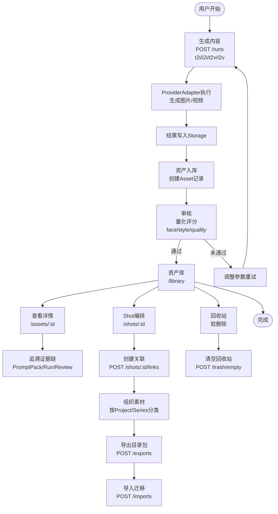
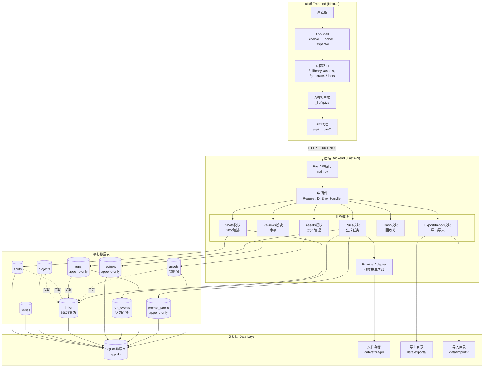
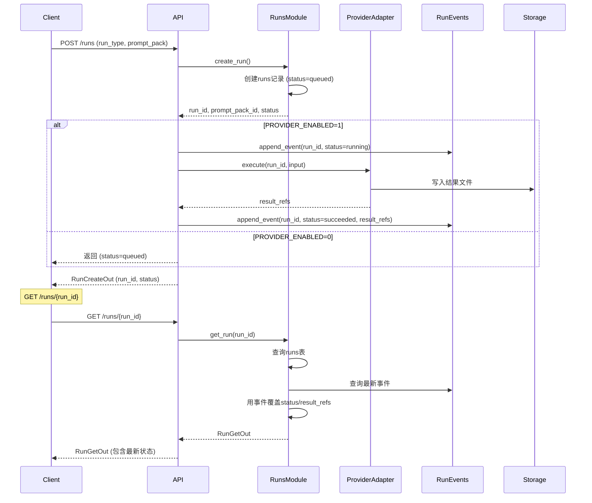
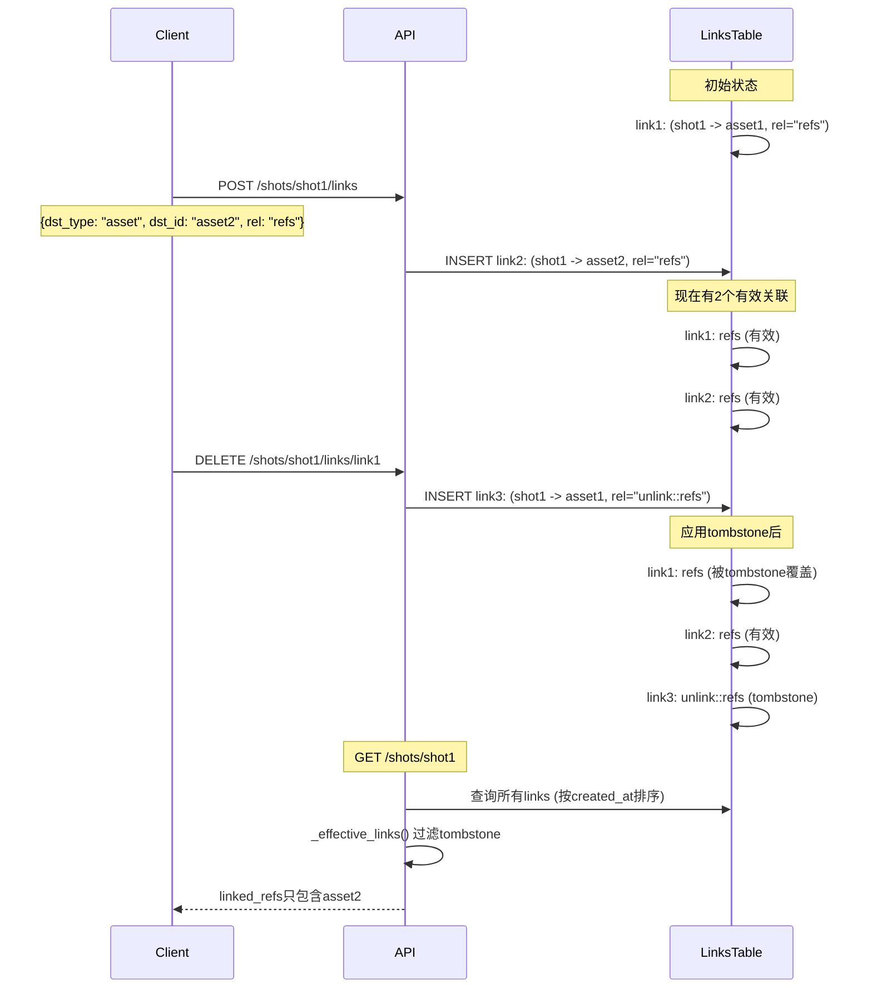
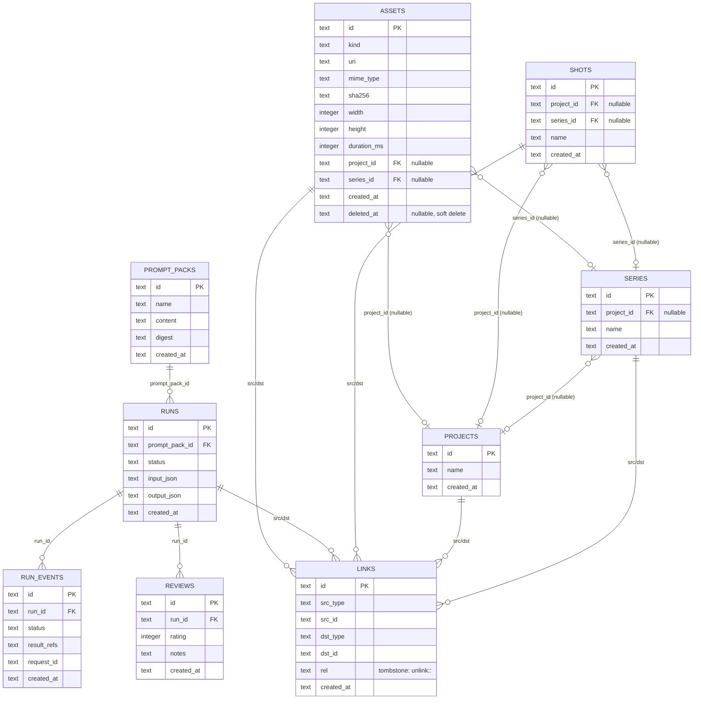

# AI Content Workstation - 项目分析文档

> 本文档用于交接给下一个AI开发者，全面分析项目功能、架构、前端等内容。

**生成时间**: 2025-12-31  
**项目名称**: AI Content Generation Workstation  
**项目路径**: `E:\01Small_Tools\AI_Content_Generation_Workstation\ai-content-workstation`

---

## 目录

- [1. 项目概述](#1-项目概述)
- [2. 技术栈](#2-技术栈)
- [3. 项目结构](#3-项目结构)
- [4. 核心功能模块](#4-核心功能模块)
- [5. 数据模型](#5-数据模型)
- [6. API接口架构](#6-api接口架构)
- [7. 前端架构](#7-前端架构)
- [8. 关键设计决策](#8-关键设计决策)
- [9. 开发与测试](#9-开发与测试)
- [10. 后续开发指南](#10-后续开发指南)

---

## 1. 项目概述

### 1.0 核心工作流



### 1.2 系统架构图



### 1.3 核心价值

AI内容生成工作站是一个**单机单用户**的内容生成与管理平台，实现AI图/视频生成→量化审核→资产入库→证据链追溯→按Shot编排引用→加密导出/迁移的完整闭环。

**核心差异点**:
- **不可变证据链**: Asset↔PromptPack↔Run↔Review↔Project/Series/Shot 的完整追溯与反向定位
- **量化审核**: face/style/quality 分数 + overall_pass，支持自动通过+抽检与人工覆写留痕
- **可携带交付**: 可加密目录包，支持无导入预览与导入迁移（关系与证据链一致）

### 1.4 用户画像

高频生成与复用AI素材的个人创作者/制片人/内容管线搭建者（单机单用户环境）

### 1.5 功能范围

**P0（必须交付）**:
- ✅ 全量资产总览：至少一个页面展示全部图片与视频资产
- ✅ 资产详情追溯：详情页展示预览/元数据/审核，并提供追溯入口
- ✅ 四类生成入口：t2i/i2i/t2v/i2v 可发起生成；结果默认入库可追溯
- ✅ 量化审核与留痕：输出 face/style/quality 分数、overall_pass、reasons[]；支持自动通过+抽检

**P1（已实现部分）**:
- ✅ Shot 编排（引用关系）+ 加密导出目录包 + 无导入预览 + 导入迁移
- ✅ ProviderAdapter 可执行化（Feature Flag）

**明确不做（Out of Scope）**:
- ❌ 多用户/权限/RBAC/协作
- ❌ NLE剪辑合成（转场/字幕/音轨/时间线渲染）
- ❌ 模型训练/微调/LoRA训练管理
- ❌ 云端同步/共享资产库（本期）
- ❌ 复杂项目管理（排期/工时/看板）

---

## 2. 技术栈

### 2.1 后端

- **框架**: FastAPI 0.115.0
- **服务器**: Uvicorn 0.30.6 (standard)
- **数据库**: SQLite（默认：`./data/app.db`）
- **ORM/迁移**: SQLAlchemy + Alembic
- **语言**: Python 3.x

### 2.2 前端

- **框架**: Next.js 16.1.0
- **UI库**: React 18.3.1
- **开发端口**: 2000
- **语言**: JavaScript/JSX

### 2.3 存储

- **数据库**: SQLite（`data/app.db`）
- **文件存储**: 本地文件系统（`data/storage/`）
- **导出**: `data/exports/{export_id}/`
- **导入**: `data/imports/{import_id}/`

### 2.4 开发工具

- **版本控制**: Git
- **测试门禁**: Bash scripts (`scripts/gate_*.sh`)
- **文档**: Markdown + YAML（需求/架构/交接文档）

---

## 3. 项目结构

```
ai-content-workstation/
├── apps/
│   ├── api/                    # 后端API服务
│   │   ├── app/
│   │   │   ├── main.py        # FastAPI应用入口
│   │   │   ├── core/          # 核心工具（db, storage）
│   │   │   └── modules/       # 业务模块
│   │   │       ├── assets/    # 资产管理
│   │   │       ├── runs/      # 生成任务
│   │   │       ├── reviews/   # 审核
│   │   │       ├── shots/     # Shot编排
│   │   │       ├── trash/     # 回收站
│   │   │       └── exports_imports/  # 导出/导入
│   │   ├── migrations/        # Alembic数据库迁移
│   │   └── requirements.txt   # Python依赖
│   └── web/                   # 前端Next.js应用
│       ├── app/               # Next.js App Router
│       │   ├── _components/   # 共享组件（AppShell, Sidebar等）
│       │   ├── _lib/          # 工具库（api.js）
│       │   ├── api_proxy/     # API代理路由
│       │   ├── assets/        # 资产页面
│       │   ├── generate/      # 生成页面
│       │   ├── library/       # 资产库页面
│       │   ├── shots/         # Shot工作台
│       │   ├── trash/         # 回收站页面
│       │   └── transfer/      # 导出/导入页面
│       └── package.json       # Node.js依赖
├── data/                      # 数据目录
│   ├── app.db                 # SQLite数据库
│   ├── storage/               # 文件存储
│   ├── exports/               # 导出目录包
│   └── imports/               # 导入记录
├── docs/                      # 文档目录
│   ├── 01_REQ_CONTRACT_SUMMARY.md    # 需求契约摘要
│   ├── 02_ARCH_CONTRACT_SUMMARY.md   # 架构契约摘要
│   ├── HANDOFF_P0_CUMULATIVE.md      # 累积交接文档（最重要）
│   └── ...                    # 其他交接文档
├── scripts/                   # 测试与工具脚本
│   ├── gate_all.sh           # 一键回归测试
│   ├── gate_*.sh             # 各功能门禁脚本
│   └── dev_api.sh            # 启动API服务
└── tmp/                       # 临时文件（测试输出等）
```

---

## 4. 核心功能模块

### 4.1 Assets（资产管理）

**功能**: 图片/视频资产的全生命周期管理

**核心API**:
- `GET /assets` - 列表（支持分页、软删除过滤）
- `GET /assets/{asset_id}` - 详情（包含追溯信息）
- `DELETE /assets/{asset_id}` - 软删除（幂等）

**关键特性**:
- 软删除（`deleted_at`字段）
- 可选的Project/Series绑定（允许为空）
- 追溯信息（链接到PromptPack/Run/Review/Project/Series/Shot）

**文件位置**:
- `apps/api/app/modules/assets/router.py`
- `apps/api/app/modules/assets/service.py`
- `apps/api/app/modules/assets/schemas.py`

### 4.2 Runs（生成任务）

**功能**: AI内容生成任务的创建与执行

**核心API**:
- `POST /runs` - 创建生成任务
- `GET /runs/{run_id}` - 查询任务状态与结果

**生成类型**:
- `t2i`: 文生图
- `i2i`: 图生图
- `t2v`: 文生视频
- `i2v`: 图生视频

**关键特性**:
- ProviderAdapter抽象（可插拔的生成器）
- Feature Flag: `PROVIDER_ENABLED=0|1`
- Append-only: 通过`run_events`记录状态迁移（不UPDATE runs表）
- 支持请求头覆盖: `X-Provider-Enabled`, `X-Provider-Force-Fail`

**执行流程**:


**文件位置**:
- `apps/api/app/modules/runs/router.py`
- `apps/api/app/modules/runs/service.py`
- `apps/api/app/modules/runs/providers/` (ProviderAdapter实现)

### 4.3 Reviews（审核）

**功能**: 量化审核与留痕

**核心特性**:
- 评分维度: face/style/quality（0.00-1.00）
- 通过规则: `overall_pass = (face>=0.80) AND (style>=0.80) AND (quality>=0.70)`
- 自动通过 + 抽检（默认5%）
- 人工覆写必须填写reason并审计

**文件位置**:
- `apps/api/app/modules/reviews/router.py`
- `apps/api/app/modules/reviews/service.py`

### 4.4 Shots（编排）

**功能**: Shot编排与引用关系管理

**核心API**:
- `GET /shots` - Shot列表（支持project_id/series_id过滤）
- `GET /shots/{shot_id}` - Shot详情（包含linked_refs）
- `POST /shots/{shot_id}/links` - 创建关联
- `DELETE /shots/{shot_id}/links/{link_id}` - 取消关联（tombstone）

**关键特性**:
- **Links是SSOT（单一事实来源）**: 所有关系变更必须走Links API
- Tombstone语义: 删除通过`unlink::<rel>`前缀实现（append-only）
- 支持关联多种类型: assets, runs, prompt_packs, projects, series等

**Tombstone机制示例**:


**文件位置**:
- `apps/api/app/modules/shots/router.py`
- `apps/api/app/modules/shots/schemas.py`

### 4.5 Trash（回收站）

**功能**: 软删除资产的管理

**核心API**:
- `POST /trash/empty` - 清空回收站（物理删除）

**文件位置**:
- `apps/api/app/modules/trash/router.py`

### 4.6 Exports/Imports（导出导入）

**功能**: 目录包导出/导入（P1）

**核心API**:
- `POST /exports` - 创建导出目录包
- `GET /exports/{export_id}` - 导出记录
- `GET /exports/{export_id}/manifest` - 只读Manifest（无导入预览）
- `POST /imports` - 从目录包导入
- `GET /imports/{import_id}` - 导入记录

**关键特性**:
- Feature Flag: `EXPORT_IMPORT_ENABLED=0|1`
- 目录包格式: `bundle.json`（表快照）+ `manifest.json`（预览）+ `blobs/`（二进制）
- Append-only导入: 默认`create_new_ids=true`（避免覆盖）
- 关系保持: Links必须可迁移

**文件位置**:
- `apps/api/app/modules/exports_imports/router.py`
- `apps/api/app/modules/exports_imports/service.py`

---

## 5. 数据模型

### 5.1 核心实体（Append-only）

这些表通过SQLite触发器强制append-only（禁止UPDATE/DELETE）:

#### assets
```sql
- id (TEXT, PK)
- kind (TEXT) -- 资产类型
- uri (TEXT)
- mime_type (TEXT)
- sha256 (TEXT)
- width/height (INTEGER)
- duration_ms (INTEGER)
- meta_json (TEXT)
- project_id (TEXT, nullable, FK -> projects.id)
- series_id (TEXT, nullable, FK -> series.id)
- created_at (TEXT)
- deleted_at (TEXT, nullable) -- 软删除标记
```

**索引**: `kind`, `sha256`

#### prompt_packs
```sql
- id (TEXT, PK)
- name (TEXT)
- content (TEXT) -- JSON序列化的PromptPack
- digest (TEXT)
- created_at (TEXT)
```
**索引**: `digest`

#### runs
```sql
- id (TEXT, PK)
- prompt_pack_id (TEXT, FK -> prompt_packs.id)
- status (TEXT) -- queued/running/succeeded/failed
- input_json (TEXT)
- output_json (TEXT)
- created_at (TEXT)
```
**索引**: `prompt_pack_id`, `status`

**注意**: 实际状态与result_refs通过`run_events`表覆盖（append-only语义）

#### reviews
```sql
- id (TEXT, PK)
- run_id (TEXT, FK -> runs.id)
- rating (INTEGER)
- notes (TEXT)
- created_at (TEXT)
```
**索引**: `run_id`

#### links
```sql
- id (TEXT, PK)
- src_type (TEXT) -- 源类型（如"shot"）
- src_id (TEXT)   -- 源ID
- dst_type (TEXT) -- 目标类型（如"asset"）
- dst_id (TEXT)   -- 目标ID
- rel (TEXT)      -- 关系类型（如"refs"）
- created_at (TEXT)
```
**索引**: `(src_type, src_id)`, `(dst_type, dst_id)`, `rel`

**Tombstone语义**: `rel = "unlink::<original_rel>"`表示取消关联

### 5.2 可选层级实体

#### projects
```sql
- id (TEXT, PK)
- name (TEXT)
- created_at (TEXT)
```

#### series
```sql
- id (TEXT, PK)
- project_id (TEXT, nullable, FK -> projects.id)
- name (TEXT)
- created_at (TEXT)
```

#### shots
```sql
- id (TEXT, PK)
- project_id (TEXT, nullable, FK -> projects.id)
- series_id (TEXT, nullable, FK -> series.id)
- name (TEXT)
- created_at (TEXT)
```

### 5.3 事件表（Append-only）

#### run_events
```sql
- id (TEXT, PK)
- run_id (TEXT, FK -> runs.id)
- status (TEXT) -- running/succeeded/failed
- result_refs (TEXT) -- JSON序列化
- request_id (TEXT)
- created_at (TEXT)
```

**用途**: 记录run状态迁移与结果引用，`GET /runs/{id}`时以最新事件覆盖runs表的字段

### 5.4 实体关系图



### 5.5 数据模型特性

1. **Append-only不变量**: PromptPack/Run/Review/Link通过触发器禁止UPDATE/DELETE
2. **软删除**: Assets支持`deleted_at`，Trash清空时才物理删除
3. **可选绑定**: Assets/Shots的Project/Series绑定允许为NULL（支持"展示全部资产"）
4. **关系SSOT**: Links是跨实体关系的唯一来源，UI不得缓存关系作为事实来源

### 5.6 数据库迁移

使用Alembic管理迁移:
- 当前head: `0003_optional_hierarchy`
- 迁移文件: `apps/api/migrations/versions/*.py`
- 初始化: `alembic upgrade head`

---

## 6. API接口架构

### 6.1 可观测性契约（Hard Lock）

#### Request Tracking
- 请求头: `X-Request-Id`（缺失则服务端生成）
- 响应头: 必须echo `X-Request-Id`
- 日志: 贯穿所有请求/响应

#### Error Envelope（统一错误格式）
```json
{
  "error": "error_code",
  "message": "human readable message",
  "request_id": "uuid",
  "details": {}
}
```

#### Health Check
`GET /health` 必须返回（keys锁定）:
```json
{
  "status": "ok",
  "version": "0.1.0",
  "db": {"status": "ok", "kind": "sqlite", "path": "..."},
  "storage": {"status": "ok", "root": "..."},
  "last_error_summary": null
}
```

#### Pagination
- 参数: `offset`, `limit`（默认50，最大200）
- 响应格式:
```json
{
  "items": [...],
  "page": {
    "limit": 50,
    "offset": 0,
    "total": 100,
    "has_more": true
  }
}
```

### 6.2 路由组织

所有路由通过FastAPI Router模块化:

```python
# apps/api/app/main.py
app.include_router(assets_router)
app.include_router(exports_imports_router)
app.include_router(runs_router)
app.include_router(reviews_router)
app.include_router(trash_router)
app.include_router(shots_router)
```

### 6.3 中间件

1. **Request ID中间件**: 生成/传递`X-Request-Id`
2. **Health Enricher**: 在`/health`响应中注入db/storage详情
3. **异常处理器**: 统一转换为error envelope格式

### 6.4 端口锁定

- **API**: 7000
- **Web**: 2000

---

## 7. 前端架构

### 7.1 Next.js App Router结构

```
apps/web/app/
├── layout.js              # 根布局（AppShell包装）
├── page.js                # 首页 (/)
├── _components/           # 共享组件
│   ├── AppShell.js       # 应用外壳（Sidebar + Topbar + MainContent + InspectorDrawer）
│   ├── Sidebar.js        # 侧边栏导航
│   ├── Topbar.js         # 顶部栏
│   └── InspectorDrawer.js # 检查器抽屉
├── _lib/
│   └── api.js            # API客户端（统一请求处理）
├── api_proxy/            # API代理（同源转发，避免CORS）
│   └── [...path]/route.js
├── library/              # 资产库页面 (/library)
├── assets/[asset_id]/    # 资产详情页
├── generate/             # 生成页面 (/generate)
├── shots/                # Shot工作台
│   ├── page.js          # 列表页 (/shots)
│   └── [shot_id]/page.js # 详情页 (/shots/:shot_id)
├── trash/                # 回收站 (/trash)
└── transfer/             # 导出/导入 (/transfer)
```

### 7.2 路由清单

**必须存在的路由**（架构锁）:
- `/` - Home
- `/library` - 资产库总览（AC-001）
- `/assets/:asset_id` - 资产详情（AC-002）
- `/generate` - 生成入口（AC-003）
- `/projects`, `/projects/:project_id` - Project（占位符）
- `/series`, `/series/:series_id` - Series（占位符）
- `/shots`, `/shots/:shot_id` - Shot工作台（P1）
- `/trash` - 回收站
- `/transfer` - 导出/导入（P1，Feature Flag）

### 7.3 API代理机制

前端通过`/api_proxy/*`转发到后端（7000端口），避免CORS问题:

```javascript
// apps/web/app/api_proxy/[...path]/route.js
// 转发逻辑：转发所有请求到 http://127.0.0.1:7000/{path}
// 透传 X-Request-Id
```

### 7.4 API客户端

`apps/web/app/_lib/api.js`提供统一的API调用函数:

- `apiFetch(path, options)` - 通用请求函数
- `listAssets(options)` - 资产列表
- `getAsset(assetId)` - 资产详情
- `softDeleteAsset(assetId)` - 软删除

**特性**:
- 自动生成`X-Request-Id`
- 统一错误处理（error envelope）
- 支持query参数构建

### 7.5 UI组件架构

**AppShell**: 应用外壳，包含:
- **Sidebar**: 导航菜单
- **Topbar**: 顶部栏（可显示状态等）
- **MainContent**: 主内容区
- **InspectorDrawer**: 右侧检查器抽屉（可打开/关闭）

**页面组件**: 使用Server Components + Client Components混合:
- Server Components: 初始数据获取
- Client Components: 交互逻辑（`"use client"`）

### 7.6 Feature Flags

- `EXPORT_IMPORT_UI_ENABLED=0|1` - 控制导出/导入UI显示

---

## 8. 关键设计决策

### 8.1 Append-only不变量

**决策**: PromptPack/Run/Review/Link禁止UPDATE/DELETE

**原因**: 保证证据链不可变，所有修改通过追加事件实现

**实现**: SQLite触发器在UPDATE/DELETE时RAISE(ABORT)

**影响**: 
- Run状态通过`run_events`表记录
- Link删除通过tombstone（`unlink::<rel>`）实现

### 8.2 Links作为SSOT

**决策**: Links表是跨实体关系的唯一事实来源

**原因**: 避免数据不一致，所有关系变更可追溯

**约束**: UI不得缓存关系作为事实来源，必须通过Links API查询

### 8.3 可选层级绑定

**决策**: Assets/Shots的Project/Series绑定允许为NULL

**原因**: 支持"展示全部资产"（无需先选Project/Series），生成后再归档

**影响**: 查询时必须处理NULL情况，UI需要支持"未绑定"状态

### 8.4 Feature Flags

**决策**: 新功能通过Feature Flag控制启用

**原因**: 便于回滚，不影响P0基线

**现有Flags**:
- `PROVIDER_ENABLED=0|1` - Provider执行开关
- `EXPORT_IMPORT_ENABLED=0|1` - 导出/导入API开关
- `EXPORT_IMPORT_UI_ENABLED=0|1` - 导出/导入UI开关

### 8.5 单机单用户架构

**决策**: 不实现多用户/权限/RBAC

**原因**: 目标用户是个人创作者，简化架构

**影响**: 无需考虑权限检查、用户隔离等

### 8.6 端口锁定

**决策**: Web=2000, API=7000（硬锁定）

**原因**: 测试门禁依赖固定端口，避免配置漂移

---

## 9. 开发与测试

### 9.1 启动服务

**后端API**:
```bash
cd apps/api
# 方式1: 使用脚本
bash scripts/dev_api.sh

# 方式2: 直接启动
uvicorn app.main:app --host 127.0.0.1 --port 7000 --reload
```

**前端Web**:
```bash
cd apps/web
npm install  # 首次运行
npm run dev  # 默认端口2000
```

### 9.2 数据库迁移

```bash
cd apps/api
alembic upgrade head  # 应用迁移
alembic revision --autogenerate -m "description"  # 创建新迁移
```

### 9.3 测试门禁（Gates）

**一键回归**:
```bash
bash scripts/gate_all.sh --mode=full
```

**单个门禁**:
```bash
bash scripts/gate_api_smoke.sh      # API基础检查
bash scripts/gate_health_contract_check.sh  # Health契约
bash scripts/gate_request_id_propagation_check.sh  # Request ID
bash scripts/gate_assets_read.sh    # 资产读取
bash scripts/gate_shots_api.sh      # Shots API
bash scripts/gate_shots_ui.sh       # Shots UI
bash scripts/gate_export_import.sh  # 导出/导入
# ... 更多见 scripts/ 目录
```

**门禁输出**: `tmp/_out_gate_<label>.txt`

### 9.4 证据收集

运行`gate_all --mode=full`后自动生成:
- `docs/EVIDENCE_P0_FULL.md` - P0回归证据（包含所有[ok]信号）

### 9.5 开发检查清单

1. ✅ API启动在7000端口
2. ✅ Web启动在2000端口
3. ✅ `gate_all --mode=full`全绿
4. ✅ OpenAPI可达: `curl http://127.0.0.1:7000/openapi.json`
5. ✅ Health检查: `curl http://127.0.0.1:7000/health`

---

## 10. 后续开发指南

### 10.1 新增API端点

1. 在对应模块下创建/修改`router.py`
2. 定义schemas（`schemas.py`）
3. 实现service逻辑（`service.py`）
4. 在`apps/api/app/main.py`中include router
5. 编写gate脚本验证
6. 更新文档

### 10.2 新增前端页面

1. 在`apps/web/app/`下创建路由目录
2. 创建`page.js`（Server Component）或使用Client Component
3. 如需API调用，使用`_lib/api.js`或创建新的API函数
4. 如需API代理，在`api_proxy/`下创建route
5. 在`Sidebar.js`中添加导航链接（如需要）

### 10.3 数据库变更

1. 创建Alembic迁移: `alembic revision --autogenerate -m "description"`
2. 检查生成的迁移文件（特别是append-only表的变更）
3. 运行迁移: `alembic upgrade head`
4. 更新`scripts/gate_models.sh`（如需要）

### 10.4 遵循契约

**必须遵守的Hard Locks**:
- ✅ 端口: Web=2000, API=7000
- ✅ Error Envelope格式
- ✅ Request ID传递
- ✅ Health检查keys
- ✅ Pagination格式
- ✅ Append-only不变量
- ✅ Links作为SSOT

**修改前必须走CR**:
- 需求变更: CR-L1 (SPEC_CHANGE_REQUEST)
- 架构变更: CR-L2 (ARCH_CHANGE_REQUEST)

### 10.5 常见陷阱

1. **Next.js重复页面**: 同一路由不能同时存在`page.js`和`page.tsx`
2. **Append-only违反**: 不要UPDATE/DELETE被保护的表
3. **关系缓存**: UI不要缓存Links关系，必须通过API查询
4. **端口冲突**: 确保7000和2000端口未被占用
5. **Git Bash管道问题**: 避免`curl | python -`，使用临时文件

### 10.6 推荐阅读

**交接文档**（按优先级）:
1. `docs/HANDOFF_P0_CUMULATIVE.md` - **最重要的交接文档**（包含所有批次信息）
2. `docs/01_REQ_CONTRACT_SUMMARY.md` - 需求契约
3. `docs/02_ARCH_CONTRACT_SUMMARY.md` - 架构契约
4. `docs/HANDOFF_BATCH*.md` - 各批次交接记录

**代码入口**:
- `apps/api/app/main.py` - API入口
- `apps/web/app/layout.js` - 前端入口
- `scripts/gate_all.sh` - 测试入口

---

## 附录：快速参考

### API端点速查

| 端点 | 方法 | 说明 |
|------|------|------|
| `/health` | GET | 健康检查 |
| `/openapi.json` | GET | OpenAPI规范 |
| `/assets` | GET | 资产列表 |
| `/assets/{id}` | GET | 资产详情 |
| `/assets/{id}` | DELETE | 软删除 |
| `/runs` | POST | 创建生成任务 |
| `/runs/{id}` | GET | 查询任务 |
| `/shots` | GET | Shot列表 |
| `/shots/{id}` | GET | Shot详情 |
| `/shots/{id}/links` | POST | 创建关联 |
| `/shots/{id}/links/{link_id}` | DELETE | 取消关联 |
| `/trash/empty` | POST | 清空回收站 |
| `/exports` | POST | 创建导出 |
| `/exports/{id}/manifest` | GET | 导出清单 |
| `/imports` | POST | 导入 |

### 环境变量

| 变量 | 默认值 | 说明 |
|------|--------|------|
| `DATABASE_URL` | `sqlite:///./data/app.db` | 数据库URL |
| `STORAGE_ROOT` | `./data/storage` | 存储根目录 |
| `APP_VERSION` | `0.1.0` | 应用版本 |
| `PROVIDER_ENABLED` | `0` | Provider开关 |
| `EXPORT_IMPORT_ENABLED` | `1` | 导出/导入API开关 |
| `EXPORT_IMPORT_UI_ENABLED` | `1` | 导出/导入UI开关 |

### 关键文件路径

- API入口: `apps/api/app/main.py`
- 数据库配置: `apps/api/app/core/db.py`
- 前端布局: `apps/web/app/layout.js`
- API客户端: `apps/web/app/_lib/api.js`
- 交接文档: `docs/HANDOFF_P0_CUMULATIVE.md`

---

**文档结束**

> 如有疑问，请参考`docs/HANDOFF_P0_CUMULATIVE.md`获取最新信息。

